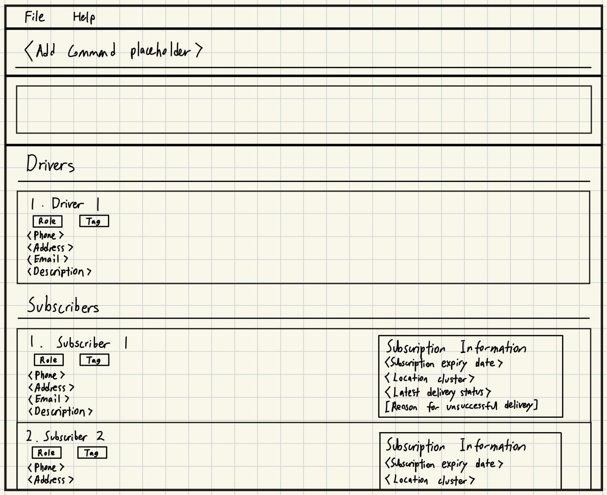

# Client2Door
**Client2Door** is your all-in-one companion for your subscription box service. If you are looking to simplify your
workflow in managing your deliveries and subscribers, Client2Door helps you simplify these tasks so that you can
shift your full focus into growing your business.

Client2Door is designed for keyboard-loving users in mind, maximising the benefits of a **Command Line Interface (CLI)**
with a clean and easy-to-use **Graphical User Interface (GUI)**.

## Features
- View the details of all your subscribers with ease
- Easily add new subscribers over time
- Search for specific subscribers
- Filter subscribers based on various fields
- View delivery status for each subscriber
- Group subscribers in location clusters to optimise delivery routes

## Acknowledgements
This project is a **part of the se-education.org** initiative. If you would like to contribute code to this project, see [se-education.org](https://se-education.org/#contributing-to-se-edu) for more info.
